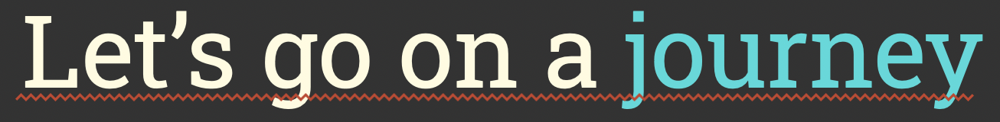
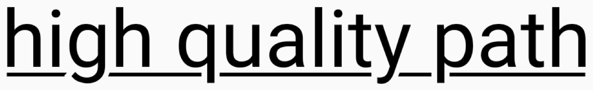

# Elegant Underline for Keynote

A command line utility to generate fancier underlines for Apple Keynote. This tool
can be invoked in two different ways: in standalone mode, or in Keynote mode.

> **Warning**
> macOS 13 required.

## Operating modes

In standalone mode, the tool will generate a PDF in the current directory. That PDF
contains an underline computed for the specified text, font, and font size, which
can be dragged and dropped directly into Keynote and positioned under the appropriate
text element.

In Keynote mode, the tool requires Keynote to be open and on the desired slide. The
tool will select the _first_ text item on the slide, and generate an underline that
matches its text content, font, and font size.

### Keynote mode

`elegant-underline [style] [color]`

- `style`: must be `jagged` or `elegant`, specifies the style of underline
- `color`: an sRGB color in hex form without any prefix (e.g. `FF00FF`)

> **Note**
> This tool tries to automatically place the generated underline on your slide, but
> it is only an approximation. It works best when the text item box is tight around
> the text, and text is left and top aligned.

### Standalone mode

`elegant-underline [style] [color] [font name] [size in points] [text]`

- `style`: must be `jagged` or `elegant`, specifies the style of underline
- `color`: an sRGB color in hex form without any prefix (e.g. `FF00FF`)
- `font name`: the PostScript font name, for instance `Baskerville-Bold` or `Helvetica`
- `size in points`: the size of text element in points, as specified in Keynote
- `text`: the text content string to underline

## Styles

`elegant-underline` supports two underline styles, jagged and elegant.

### Jagged

This style can be used to replicate the jagged underline style seen in programming
IDEs. It is particularly useful when presenting code in a slide:

### Elegant

This style produces an underline that never crosses any descenders, avoiding the
visual clutter caused for instance when underlining text content with letters such
as "p" or "g".

## License

This repository is licensed under the [Apache 2.0 license](./LICENSE).
